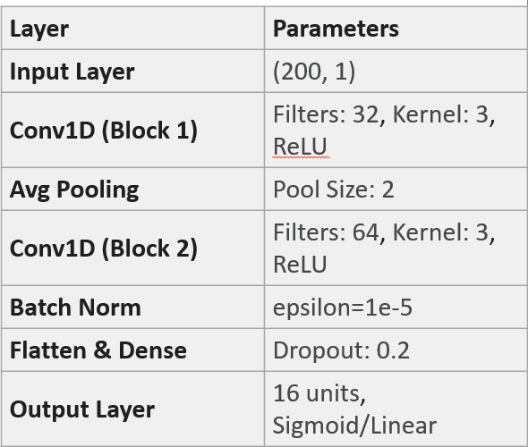

# VTIRF-project
除非有時間，否則CNN不是什麼好辦法呦
# 正文
## 問題敘述
設計一維多層結構， 能使用的材料有Ag， Al2O3， HfO2， SiO2， 總層數不超過16層，總厚度不超過800nm， 使得該結構的透射光譜的FOM最大。

FOM定義：

## 解決方案
訓練一個能根據輸入光譜輸出相對應結構的模型， 訓練完成後， 輸入理想光譜，就能獲得理想結構。這裡使用的模型是CNN

本研究中使用的 1D-CNN (一維卷積神經網路) 模型是專門為處理 光譜序列數據 到 薄膜結構參數 的逆向設計任務而構建的。以下是該 CNN 模型的技術細節介紹：1. 模型架構設計 (Model Architecture)此 1D-CNN 採用了多層卷積結構，旨在從高維的光譜特徵中提取局部物理特徵：輸入層 (Input Layer)：接收維度為 (200, 1) 的數據，代表光譜在 400nm 至 2000nm 區間的 200 個採樣點。卷積層 (Conv1D Blocks)：第一層：32 個濾波器 (Filters)，卷積核大小 (Kernel Size) 為 3，使用 ReLU 激活函數。第二層：64 個濾波器，卷積核大小為 3，同樣使用 ReLU。池化層 (Pooling Layer)：使用 Average Pooling (Pool Size: 2) 進行降維，保留光譜特徵的全局平均資訊。正規化與防過擬合：包含 Batch Normalization 以增強梯度穩定性，以及 Dropout (0.2) 減少過擬合風險。輸出層 (Output Layer)：16 個單元，分別對應 16 層薄膜的厚度參數，使用 Sigmoid 或 Linear 激活函數進行數值預測。

